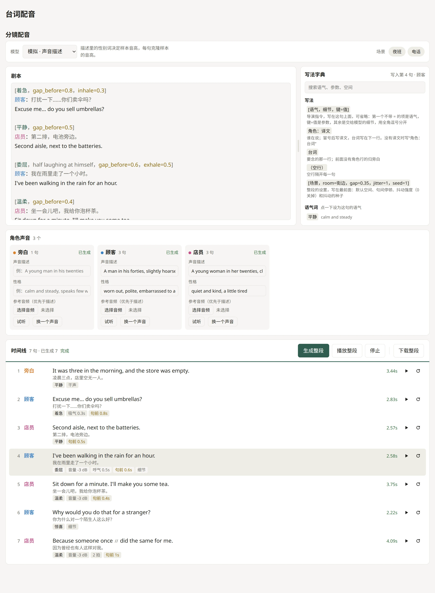

# tts-board

tts-board 是一个给多角色对白配音的网页。在页面上按固定格式写剧本和导演指令，给每个角色定一个声音，然后逐句或整段交给 TTS 后端生成，再拼成一段带停顿、呼吸和空间混响的对白。另有单句对比，把同一句话交给后端的每个模型各生成一遍。

页面负责写剧本、排队和播放，生成和拼接由后端完成，后端可以用任何语言和模型，只要实现下面的「后端接口」。仓库带一个只用 Python 标准库的模拟后端，它用合成的元音代替语音，可以直接试用页面的全部流程。

<picture>
  <source media="(prefers-color-scheme: dark)" srcset="docs/screenshot-dark.webp">
  
</picture>

## 试用

```bash
python server/mock_server.py
```

然后打开 http://127.0.0.1:8765/ 。端口可以作为参数传入，例如 `python server/mock_server.py 9000`。模拟后端需要 Python 3.8 以上；页面需要 2022 年以后的 Chrome、Edge、Firefox 或 Safari。

1. 在「场景」里点一个示例场景，剧本载入左边的编辑框
2. 在「模型」里选一个模型，角色卡片随模型的能力变化
3. 点「生成整段」，再点「播放整段」

模拟后端遵循音量、语速、音高、分拍、停顿和呼吸，忽略表演指令、空间和抖动。生成的音频在 `server/outputs/`。

## 写剧本

一句由几行组成，句与句之间空一行：

```
[场景，room=室内，gap=0.35，jitter=1，seed=1]

[着急，gap_before=0.8，inhale=0.3]
顾客：打扰一下……你们卖伞吗？
Excuse me... do you sell umbrellas?

旁白：For a moment, neither of them spoke.
```

- 第一行是整段的设置：默认空间、句间停顿（秒）、抖动强度（0 关掉）和抖动的随机种子。缺的项取默认值：干声，`defaults.gap`，强度 1，`defaults.jitter.seed`
- `[语气，细节，键=值]` 是这句的导演指令，可以省略，也可以写成 `【】`。各项用全角逗号 `，` 分开：第一个不带 `=` 的项是语气，`键=值` 是参数，其余各项是细节。细节里的半角逗号不断开，所以一项细节可以列几个要求
- `角色：译文` 写谁在说，下一行是要念的台词。没有译文时写成一行 `角色：台词`
- 前面没有角色行的台词归「旁白」
- 台词里的 ` / ` 把一句分成几拍，每拍单独生成，拍间停 `beat_gap` 秒；` // ` 停 `long_beat_gap` 秒。拍首用全角方括号写的 `［细节］` 只加给这一拍

语气在 `tones` 里有预设时，带来预设的表演指令和参数；没有预设的语气词本身就是表演指令。语气和细节依次拼成交给模型的表演指令。

页面默认按位置区分台词和译文：角色行后面紧跟一行时，那一行是台词，角色行冒号后的内容是译文；角色行后面没有这一行时，冒号后的内容是台词。如果台词和译文用不同的文字，可以在 `data/project.json` 里设 `text_script`，写 Unicode 文字名，例如 `"Thai"`、`"Devanagari"`、`"Latin"`。这时页面按文字区分：含这种文字的行是台词，角色行冒号后不含这种文字的内容是译文，其余不含这种文字的行标红。角色名也不能含这种文字，否则 `Tom: Hi!` 会被当成一句旁白。

编辑框下方的时间线跟着剧本更新。点时间线上的一句，光标跳到剧本里的这一句；再点右边「写法字典」里的语气、参数或空间，就写进这句的导演指令。只改停顿、呼吸或空间时，这句已经生成的音频保留。撤销一次修改时，被改掉的那句的音频也会回来。

### 参数

| 参数 | 作用 |
|------|------|
| `level_db` | 音量偏移，dB |
| `pace` | 语速倍数 |
| `pitch_st` | 音高偏移，半音 |
| `gap_before` | 这句开口前的停顿，秒；负数让这句压着上一句开口 |
| `inhale` | 开口前的吸气声，秒 |
| `exhale` | 说完后的呼气声，秒 |
| `room` | 这句的空间，写 `rooms` 里的 `label` 或键，`干声` 表示不加混响 |

一句的最终设置按这个顺序合并：`defaults`、语气预设、场景、角色、这句。`level_db` 和 `pitch_st` 相加，`pace` 相乘，其余参数取最后设置它的一层。时间线上每句下面的标签列出与普通句子不同的值，鼠标悬停可以看到完整的表演指令。

### 角色的声音

页面按模型在 `controls` 里声明的能力给角色定声音：

- 有 `speaker`：每个角色固定一个说话人编号，可以在角色卡片上改
- 有 `ref_audio`：页面先生成角色念 `anchor_text` 的一段样本，之后这个角色的每一句都以这段样本为参考音频。模型有 `voice_prompt` 时，样本按角色卡片上的「声音描述」和「性格」生成；上传了参考音频时，以上传的音频为准
- 都没有：所有角色同一个声音

模型有 `ref_text` 时，句子还会带上样本的原文 `ref_text`。发送了表演指令（模型有 `voice_prompt`）或分了拍的句子不带原文，因为按原文续写的模型会把表演指令当成要念的字。

样本有下面两种问题时，页面重新生成，最多生成四次：

- 声音描述里写了性别（如 woman、man、女、男），而样本的中位音高不符：女声低于 165 Hz，男声高于 160 Hz。这一项需要后端在结果里返回 `f0`
- 项目设了 `anchor_min_f0_range`，而样本的音高起伏 `f0_range` 低于它。角色的每一句都克隆样本，样本平，这个角色的每一句都平。后端没有返回 `f0_range` 时这一项算通过

样本只存在页面内存里，刷新页面后角色会换成新的声音。要固定一个声音，把它的音频作为参考音频上传。

## 项目数据

页面启动时读取 `data/project.json`，再读取 `scripts` 列出的 `data/scripts/` 下的剧本文件。把这两处换成自己的内容，就是一个新项目。下面的字段都可以省略，但没有 `scripts` 就没有场景，有 `ref_audio` 的模型需要 `anchor_text`。

`data/project.json`：

| 字段 | 内容 |
|------|------|
| `title` | 页面标题 |
| `text_script` | 台词所用文字的 Unicode 名称，见「写剧本」 |
| `fonts` | Google Fonts 字体名列表，排在页面默认字体前面，用来显示默认字体缺的文字，例如 `["Noto Sans Thai"]` |
| `anchor_text` | 每个角色的声音样本念的句子，用台词的语言写 |
| `anchor_min_f0_range` | 声音样本音高起伏的下限，半音，见「角色的声音」。合适的值随语言和素材变化，不设就不检查 |
| `default_model` | 打开页面时选中的模型 id |
| `scripts` | `data/scripts/` 下的剧本文件名 |
| `defaults` | `gap`、`beat_gap`、`long_beat_gap`、`level_db`、`pace`、`pitch_st` 的默认值，以及传给后端的 `jitter` |
| `tones` | 语气词到预设的映射：`instruction` 是表演指令，另可带上面的任一参数 |
| `rooms` | 空间：`label` 是剧本里写的名称，其余字段原样传给后端 |
| `lines` | 单句对比里的常用句，字段同剧本文件的 `lines` |

剧本文件：

| 字段 | 内容 |
|------|------|
| `title` | 剧本名，用作单句对比里的分组名 |
| `room` | 剧本的默认空间 |
| `roles` | 角色名到默认设置的映射：`voice` 和 `personality` 填进角色卡片的「声音描述」和「性格」；`anchor_text` 让这个角色的样本念自己的句子，适合情绪单一的角色；另可带参数和 `jitter` |
| `lines` | 句子：`id` 在剧本内唯一，也是单句对比里按钮上的文字；`role`、`text`（台词）、`gloss`（译文）；`voice` 填进单句对比的声音描述；`tone`、`note`（细节）、参数和 `room` 是这句的导演指令 |
| `scenes` | 场景：`label`、`room`、`gap`、`pace`、`jitter`，以及 `lines`，按顺序列出句子的 `id`。每项可以带 `tone`、`note`、参数和 `room`，替换这句自己的同名设置 |

抖动让整段的音量、停顿、语速、音高和呼吸不完全重复。页面把 `defaults.jitter` 和场景的 `jitter` 按维度合并，种子取设置行里的 `seed`。合并结果连同各角色的 `jitter` 和设置行里的强度一起发给后端。这些字段的含义由后端定义；示例数据里的子字段是一种后端的格式，模拟后端不读它们。

## 后端接口

页面用相对路径请求数据和接口，所以后端要在同一个地址下提供三样东西：`web/` 里的页面文件，项目的 `data/`，以及 `api/` 下的接口。模拟后端把 `web/` 作为站点根目录，`data/` 和 `api/` 都挂在根目录下。出错时返回非 2xx 状态和 `{"detail": "说明"}`，页面会显示这段说明。`server/mock_server.py` 是这些接口的一个可运行的实现。

### `GET api/models`

返回模型列表，每项：

| 字段 | 内容 |
|------|------|
| `id`、`name` | 必填 |
| `controls` | 模型接受的输入，取自 `voice_prompt`、`ref_audio`、`ref_text`、`speaker`、`seed` |
| `speakers` | 有 `speaker` 时，说话人的数量 |
| `org`、`voices`、`license`、`note` | 显示在模型卡片上 |
| `loaded` | 为 `false` 时，第一次生成显示「加载模型并生成…」 |
| `missing` | 模型不可用的原因；有值时页面禁用这个模型 |

### `POST api/jobs`

把一句排进生成队列，立即返回任务状态。请求是 `multipart/form-data`：

| 字段 | 内容 |
|------|------|
| `model`、`text` | 必填。`text` 是去掉分拍记号的整句台词 |
| `priority` | 数值大的先生成。单独点的句子和它需要的样本最先，整段排队时的角色样本其次，整段的句子最后，按顺序排 |
| `level_db`、`pace`、`pitch_st` | 这句的音量、语速和音高，后端在生成时应用 |
| `voice_prompt` | 声音描述或表演指令 |
| `speaker`、`seed` | 说话人编号、随机种子 |
| `ref_audio` | 上传的参考音频文件 |
| `ref_file` | 后端已有的参考音频，取自之前结果里的 `file` 或 `ref_saved` |
| `ref_text` | 参考音频的原文 |
| `beats` | 分拍的 JSON 列表 `[{text, instruction, gap_after}]`。不支持分拍的后端读 `text` 即可 |

### `GET api/jobs?ids=a,b`

返回 `{id: 状态}`，后端不认识的 id 不列出。状态是 `{id, state, ahead, result, error}`：`state` 为 `queued`、`running`、`done`、`error` 或 `cancelled`；排队时 `ahead` 是前面的任务数；出错时 `error` 是说明；完成时 `result` 是：

| 字段 | 内容 |
|------|------|
| `url` | 页面能播放的音频地址 |
| `file` | 这条音频在后端的标识，页面在 `ref_file` 和拼接时传回 |
| `duration` | 时长，秒 |
| `seconds`、`first_load` | 生成耗时，以及是否包含加载模型 |
| `f0` | 中位音高，Hz，用于检查样本的性别 |
| `f0_range` | 音高起伏，半音，用于检查样本是否太平；怎么测由后端决定，测不出时为 `null` |
| `ref_saved` | 请求带 `ref_audio` 时，上传文件在后端的标识 |

### `DELETE api/jobs/{id}`

取消还没开始的任务。

### `POST api/concat`

把生成好的句子拼成一段，请求是 JSON：

| 字段 | 内容 |
|------|------|
| `files` | 按顺序排列的 `file` |
| `levels` | 每句的 `level_db`。生成时已经应用过；拼接时重新统一响度的后端用它定每句的目标 |
| `gap`、`gaps` | 默认停顿和每句开口前的停顿，秒；负数表示与上一句交叠 |
| `inhales`、`exhales` | 每句前后的呼吸长度，秒 |
| `speakers` | 每句的角色名 |
| `room`、`rooms` | 整段的空间和每句的空间，即 `rooms` 里的条目去掉 `label`；`null` 表示干声 |
| `jitter`、`role_jitter`、`jitter_scale` | 抖动设置，见「项目数据」 |

返回 `{url, duration, starts}`。`starts` 是每句（含吸气）在成品里开始的秒数，播放整段时页面据此高亮当前句。

## 文件

| 文件 | 内容 |
|------|------|
| `web/index.html`、`web/style.css` | 页面结构和样式 |
| `web/app.js` | 剧本解析、角色声音、时间线、写法字典和单句对比 |
| `web/plan.js` | 导演指令行的读写、分拍，以及把各层设置合并成一句的计划 |
| `web/api.js` | 对后端接口的全部调用 |
| `data/` | 示例项目，页面以 `data/` 的地址读取 |
| `server/` | 模拟后端 `mock_server.py` |
| `docs/` | README 里的截图 |

## 许可

MIT
